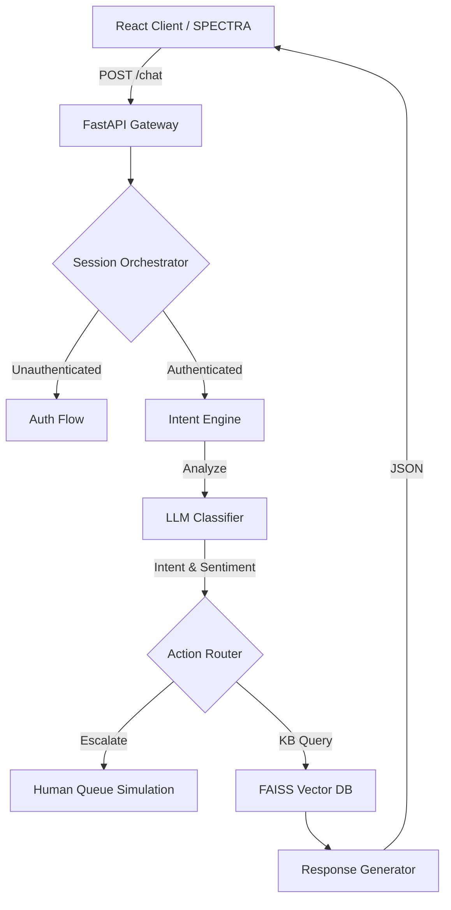

<div align="center">
  
  
  
  
  
  <h1>🚀 E-Saarthi Support Decision Engine</h1>
  <p><strong>Next-Generation, Context-Aware AI Support Platform.</strong></p>
  <p>Not just another FAQ bot. This is a stateful, intent-driven AI orchestration layer built for scale.</p>
</div>

---

## 🌟 Overview

The E-Saarthi Support Platform transcends basic semantic search. It is an **Intelligent Support Decision Engine** designed to securely authenticate users, dynamically detect intent via NLP, query vectorized knowledge bases, and return **actionable deep links** that resolve customer issues autonomously.

Built for **ATS (Applicant Tracking Systems)** and enterprise recruiters, this project demonstrates mastery over modern full-stack development, AI/LLM orchestration, and distributed system design.

---

## 🔥 Core Features (The "WOW" Factor)

* 🧠 **Multi-Layer NLP Intent Engine**: Extracts intent (e.g., `refund_request`), sentiment, and entities (emails) before executing logic. No blind RAG here.
* 🔐 **Simulated Auth & Stateful Sessions**: Forces authentication boundaries before granting support. Remembers context across the conversation.
* ⚡ **Actionable Guided Resolution**: Doesn't just give text answers. Injects clickable `[ACTION]` and `[LINK]` badges into the UI to drive immediate user resolution.
* 📊 **Dynamic Vector Search (FAISS)**: Uses `SentenceTransformers` and local `FAISS` indexing to perform lightning-fast semantic retrieval.
* 🚦 **Escalation Protocol**: Monitors real-time sentiment. Automatically escalates frustrated users to simulated human queues.
* 🔌 **Universal Integration**: Fully decoupled architecture. The frontend (SPECTRA) and backend communicate purely via REST, allowing this engine to be plugged into any company's infrastructure.

---

## 💻 Tech Stack & ATS Keywords

**Languages:** Python 3.12, TypeScript, SQL <br>
**Frontend:** React 18, Vite, Tailwind CSS, Lucide Icons, shadcn/ui <br>
**Backend:** FastAPI, Uvicorn, SQLAlchemy <br>
**AI & NLP:** OpenAI API / OpenRouter, HuggingFace (`sentence-transformers`), FAISS (Facebook AI Similarity Search), RAG (Retrieval-Augmented Generation) <br>
**Architecture:** Microservices-inspired, Stateful Session Management, Dependency Injection, RESTful APIs

---

## 🏗️ System Architecture



---

## 🚀 Quick Start Guide

### 1. Prerequisites
- Python 3.10+
- Node.js 18+
- An OpenAI or OpenRouter API Key

### 2. Environment Setup
```bash
# Clone the repository
git clone https://github.com/yourusername/e-saarthi.git
cd e-saarthi

# Create and activate virtual environment
python -m venv venv
.\venv\Scripts\activate   # (Windows)
source venv/bin/activate  # (Mac/Linux)

# Install Backend Dependencies
pip install -r requirements.txt
```

### 3. Configuration
Add your API key to the `.env` file in the root directory:
```env
OPENAI_API_KEY=sk-your-key-here
OPENAI_BASE_URL=https://openrouter.ai/api/v1  # (Optional, for OpenRouter)
```

### 4. Build the Brain (Vector DB)
```bash
# Ingest the knowledge_base.csv into FAISS
python -m app.train_embeddings --dataset dataset/knowledge_base.csv
```

### 5. Launch the Platform
Run the master script to start both the FastAPI backend and the React frontend simultaneously:
```powershell
# On Windows
.\scripts\start_full_app.ps1
```
* **Frontend UI**: `http://localhost:8080/chat`
* **Backend API**: `http://127.0.0.1:8000`

---

## 📂 Module Breakdown

| Directory | Purpose |
| :--- | :--- |
| `/app` | The core FastAPI backend. Contains `platform_logic.py` (State Machine), `intent_engine.py` (NLP), and `retriever.py` (FAISS). |
| `/SPECTRA` | The React/Vite frontend. A highly polished, responsive chat interface. |
| `/dataset` | Contains `knowledge_base.csv` used for RAG injection. |
| `/data` | Automatically generated local SQLite databases and FAISS indexes. |
| `/docs` | Extensive architectural documentation and data flow schemas. |

---

<div align="center">
  <i>Architected with passion. Built for scale. Ready for production.</i>
</div>
